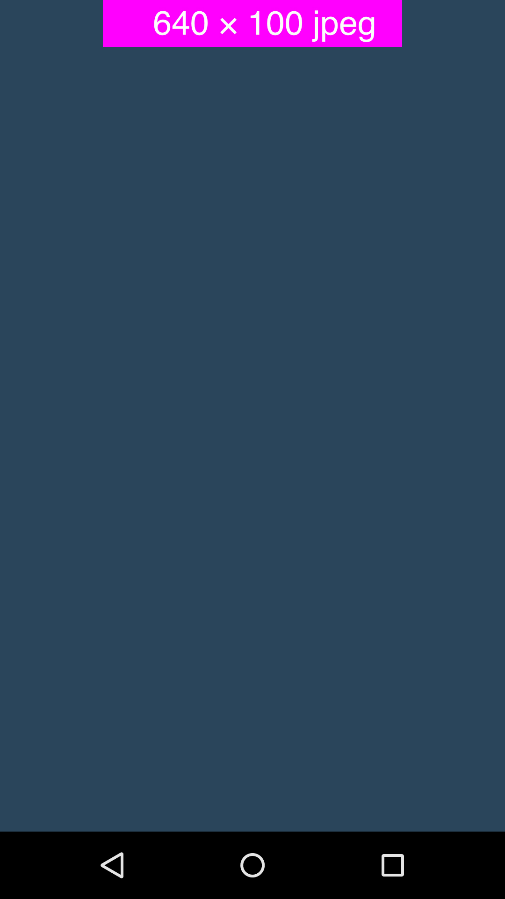
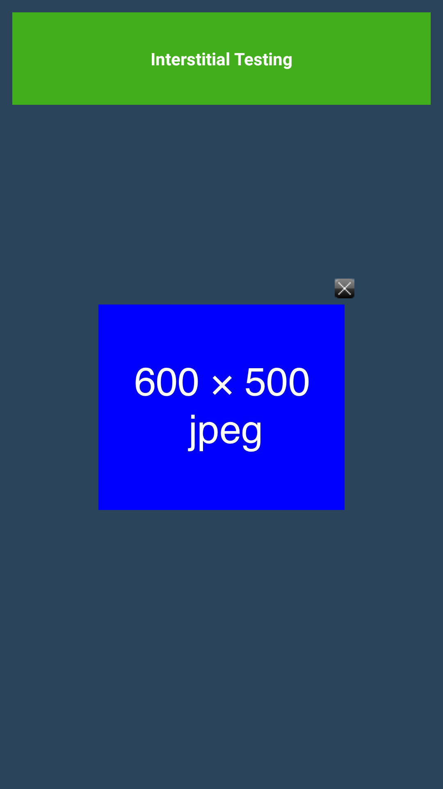
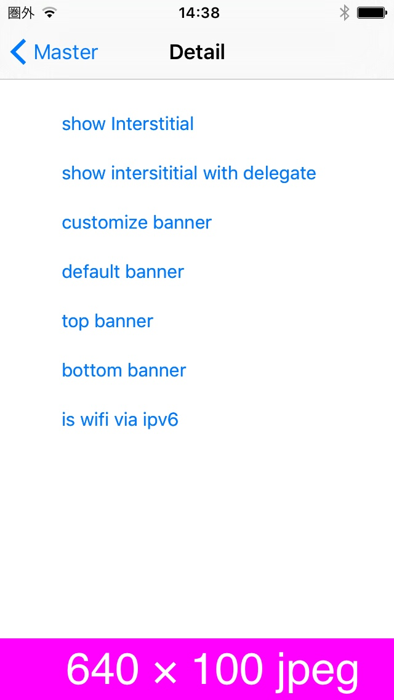

# 広告配信機能

## 1. 環境設定

### 必須ライブラリ

|OS|ファイル名|修正|
|:---:|:---|:---|
|共通|DLCoBanner.h|バナー広告表示用ライブラリヘッダ|
|共通|DLCoInterstitial.h|インタースティシャル広告表示用ライブラリヘッダ|
|Android|FoxUtil.h|ユーティリティライブラリヘッダ|
|Android|FoxUtil.cpp|ユーティリティライブラリ|
|Android|NativeBannerListener.h|バナー広告表示イベント用リスナーヘッダ|
|Android|NativeBannerListener.cpp|バナー広告表示イベント用リスナー|
|Android|NativeInterstitialListener.h|インタースティシャル広告表示イベント用リスナーヘッダ|
|Android|NativeInterstitialListener.cpp|インタースティシャル広告表示イベント用リスナー|
|Android|co_cyberz_dahlia_wrapper_cocos2dx_Banner.h|バナー広告表示イベントの受信用ラッパー|
|Android|co_cyberz_dahlia_wrapper_cocos2dx_Banner.cpp|バナー広告表示イベントの受信用ラッパー|
|Android|co_cyberz_dahlia_wrapper_cocos2dx_Interstitial.h|インタースティシャル広告表示イベントの受信用ラッパー|
|Android|co_cyberz_dahlia_wrapper_cocos2dx_Interstitial.cpp|インタースティシャル広告表示イベントの受信用ラッパー|
|iOS|DLAdStateDelegate.h|広告表示イベント処理のデリゲート|
|iOS|DLUAdStateDelegateImp.h|広告表示イベント処理用デリゲートのラッパー|
|iOS|DLUAdStateDelegateImp.m|広告表示イベント処理用デリゲートのラッパー|
|iOS|DLUInterface.h|広告表示用ライブラリのラッパー|
|iOS|DLUInterface.m|広告表示用ライブラリのラッパー|

### 1.1 Android

組み込み対象のアプリにはGooglePlayServicesをご導入の上、AdvertisingIDを取得出来ることが必須となっております。<br>
AdvertisingIDを取得するには[`こちら`](/lang/ja/doc/integration/android/google_play_services/README.md)をご確認ください。

### AndroidManifest.xmlの設定

**[Activityの追加]**

インタースティシャル広告を表示する際に必須となるActivityとなります。<br>
以下、そのままコピーして&lt;application&gt;タグ内にご設定ください。

```xml
<activity
    android:name="co.cyberz.dahlia.DahliaActivity"
    android:theme="@android:style/Theme.Translucent" />
```

### 1.2 iOS

### 必須framework

* UIKit.framework
* Foundation.framework
* AdSupport.framework
* SystemConfiguration.framework
* Security.framework

## 2. API

### DLCoBanner

|返り値型|メソッド|詳細|
|:---:|:---|:---|
|-|DLCoBanner ( const char* placementId, int position) <br><br>`placementId` : 広告表示ID(管理者より発行されます)<br>`position` : 配置位置（0 : 画面上部 / 1 : 画面下部）|コンストラクタ|
|void|show ( )|バナー広告を表示します。|
|void|hide ( )|バナー広告を非表示にします。|

|返り値型|イベントハンドラ|詳細|
|:---:|:---|:---|
|void|onCocosAdSuccess|正常に広告が表示された場合に呼ばれます。|
|void|onCocosAdFailed|広告の表示に失敗した場合に呼ばれます。|

### DLCoInterstitial

|返り値型|メソッド|詳細|
|:---:|:---|:---|
|-|DLCoInterstitial ( const char* placementId ) <br><br>`placementId` : 広告表示ID(管理者より発行されます)|コンストラクタ|
|void|show ( )|インタースティシャル広告を表示します。|

|返り値型|イベントハンドラ|詳細|
|:---:|:---|:---|
|void|onCocosAdSuccess|正常に広告が表示された場合に呼ばれます。|
|void|onCocosAdFailed|広告の表示に失敗した場合に呼ばれます。|
|void|onCocosAdExit|広告が閉じられた場合に呼ばれます。|


## 3. コードへの組み込み

### 広告表示サンプル

```cpp
#include "SampleScene.h"
#include "DLCoBanner.h"
#include "DLCoInterstitial.h"

DLCoBanner* dlb;

Scene* Sample::createScene()
{
  ...
}

// バナー広告表示(画面上部)
void Sample::showBannerTop(Ref* pSender)
{
    int position = 0;
    char* placementId = ((char*)"sample_banner001");
    dlb = new DLCoBanner(placementId, position);
    dlb->onCocosAdSuccess = CC_CALLBACK_0(Sample::onLoadAdSuccess, this);
    dlb->onCocosAdFailed = CC_CALLBACK_0(Sample::onLoadAdFailed, this);
    dlb->show();    
}

// バナー広告表示解除
void Sample::hideBanner(Ref* pSender)
{
  dlb->hide();
}

// インタースティシャル広告
void Sample::showInterstitial(Ref* pSender)
{
  char* placementId = ((char*)"sample_interstitial001");
  DLCoInterstitial* di = new DLCoInterstitial(placementId);
  di->onCocosAdSuccess = CC_CALLBACK_0(Sample::onLoadAdSuccess, this);
  di->onCocosAdFailed = CC_CALLBACK_0(Sample::onLoadAdFailed, this);
  di->onCocosAdExit = CC_CALLBACK_0(Sample::onInterstitialExit, this);
  di->show();
}

// 広告が正常に表示された場合のイベントリスナー
void Sample::onLoadAdSuccess()
{
    CCLOG("Show Ads Success!");
}

// 広告表示が失敗した場合のイベントリスナー
void Sample::onLoadAdFailed()
{
    CCLOG("Show Ads Failed!!!");
}

// インタースティシャルが閉じられた場合のイベントリスナー
void Sample::onInterstitialExit()
{
    CCLOG("Interstitial closed");
}

```

## 4. 表示サンプル

### [Android] バナー広告サンプル

<table>
<tr>
<td align="center" style="border-style:none;">[バナー広告サンプル]</td>
<td align="center" style="border-style:none;">[インタースティシャル広告サンプル]</td>
</tr>
<tr>
<td style="border-style:none;"></td>
<td style="border-style:none;"></td>
</tr>
</table>

### [iOS] バナー広告サンプル

<table>
<tr>
<td align="center" style="border-style:none;">[バナー広告サンプル]</td>
<td align="center" style="border-style:none;">[インタースティシャル広告サンプル]</td>
</tr>
<tr>
<td style="border-style:none;"></td>
<td style="border-style:none;"></td>
</tr>
</table>

---
[トップ](/lang/ja/README.md)
